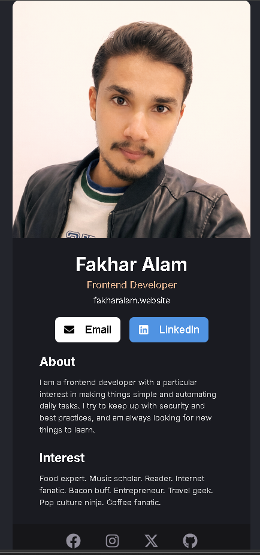

# Digital Business Card (React)

A modern digital business card built using React, inspired by a clean Figma design.
This project focuses on component structure, layout precision, and UI consistency.

---

## 📸 Preview



---

## 🚀 Features

* Built with React + Vite
* Component-based structure (Header, MainContent, Footer)
* Clean and minimal UI design
* Social media icons using React Icons
* Responsive centered layout
* Dark theme design inspired by Figma

---

## 🧠 What I Learned

* Structuring a React project using reusable components
* Managing file paths and assets correctly
* Translating a Figma design into real UI
* Writing organized CSS for different sections
* Using external libraries like React Icons

---

## 🛠️ Tech Stack

* React
* Vite
* CSS3
* React Icons

---

## 📂 Project Structure

```
src/
│
├── Components/
│   ├── Header.jsx
│   ├── MainContent.jsx
│   └── Footer.jsx
│
├── UI-CSS/
│   ├── Header.css
│   ├── MainContent.css
│   └── Footer.css
│
├── assets/
│   └── profile.png
│
├── App.jsx
├── main.jsx
└── index.css
```

---

## ▶️ Getting Started

1. Clone the repository

```
git clone https://github.com/ThisisAlam/Digital-card-with-React.git
```

2. Navigate into the project

```
cd digital-card-with-react
```

3. Install dependencies

```
npm install
```

4. Run the development server

```
npm run dev
```

---

## 🌐 Live Demo

Currently not deployed.

---

## 🔗 Connect with Me

* LinkedIn: https://www.linkedin.com/in/fakhar-e-alam-a046133b4/

---

## 📌 Future Improvements

* Add light/dark mode toggle
* Make buttons functional (email & social links)
* Improve responsiveness
* Add animations and transitions

---

## ⭐ Support

If you like this project, consider giving it a star ⭐
